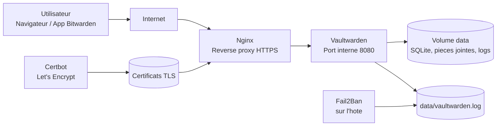
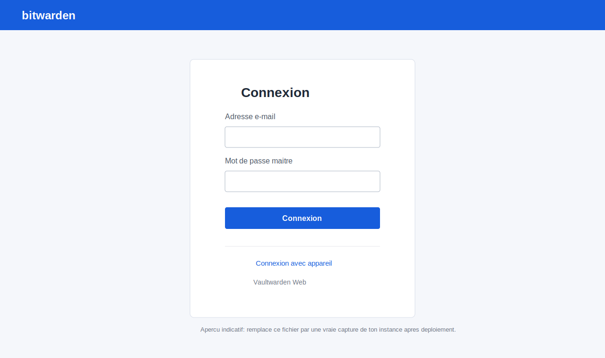

# Vaultwarden Docker

Deploiement Vaultwarden securise avec Docker Compose, Nginx et Let's Encrypt.


## Outils utilises

### Systemes & plateformes


### Services


## Architecture



Flux reseau:

- `80/tcp`: challenge Let's Encrypt puis redirection vers HTTPS.
- `443/tcp`: entree publique Nginx.
- `8080/tcp`: port interne Docker, non expose sur Internet.

## Apercu



Cette image est un apercu documentaire. Apres le premier demarrage, remplace-la par une vraie capture de ton instance si tu veux montrer l'ecran exact de ton serveur.

## Securite activee

Les points ci-dessous correspondent a la configuration de production avec Nginx et TLS:

- HTTPS via Nginx + Certbot.
- Vaultwarden n'expose aucun port public.
- Inscriptions, invitations et indices de mot de passe desactives par defaut.
- Token admin lu depuis un secret local non versionne.
- Conteneur Vaultwarden en utilisateur non-root.
- Capabilities Docker supprimees et `no-new-privileges` active.
- Filesystem des conteneurs en lecture seule quand possible.
- Logs Vaultwarden dans `data/vaultwarden.log`, compatibles Fail2Ban.
- Images epinglees: `vaultwarden/server:1.35.7-alpine`, `nginx:1.29-alpine`, `certbot/certbot:v5.0.0`.

## Prerequis

- Pour le PoC: Docker et Docker Compose suffisent.
- Pour la production: un nom de domaine pointant vers le serveur.
- Pour la production: ports `80/tcp` et `443/tcp` ouverts vers ce serveur.

## PoC local sans domaine

Le PoC demarre Vaultwarden directement sur `http://localhost:8080`, sans Nginx et sans Let's Encrypt.
Il est utile pour valider rapidement l'installation, l'interface et le stockage local.

1. Cree un `.env` adapte au PoC:

```bash
make poc-env
```

2. Prepare les dossiers:

```bash
make prepare
```

3. Genere le token admin:

```bash
make token
```

4. Demarre le PoC:

```bash
make poc-up
```

5. Verifie l'etat et les logs:

```bash
make poc-ps
make poc-logs
```

Acces PoC:

- application: `http://localhost:8080`
- administration: `http://localhost:8080/admin`

Limites du PoC:

- pas de TLS
- pas de vrai nom de domaine
- pas d'exposition Internet recommandee
- pas de challenge Let's Encrypt

Si tu veux valider la configuration PoC avant le demarrage:

```bash
make poc-config
```

## Passage en production avec un vrai domaine

Quand le PoC est valide, tu peux passer en production avec Nginx, HTTPS et un vrai domaine.

1. Arrete le PoC:

```bash
make poc-down
```

2. Remplace le `.env` PoC par une configuration production:

```bash
cp .env.example .env
```

3. Edite `.env` et renseigne au minimum:

```dotenv
DOMAIN=https://vaultwarden.mondomaine.fr
NGINX_HOST=vaultwarden.mondomaine.fr
ACME_EMAIL=robin@mondomaine.fr
```

4. Verifie les prerequis reseau:

- le domaine pointe deja vers l'IP publique du serveur
- les ports `80/tcp` et `443/tcp` sont ouverts

5. Initialise le certificat Let's Encrypt:

```bash
make certs
```

6. Demarre la stack de production:

```bash
make up
```

7. Controle le demarrage:

```bash
make ps
make logs
```

Acces production:

- application: `https://vaultwarden.mondomaine.fr`
- administration: `https://vaultwarden.mondomaine.fr/admin`

Si tu veux verifier la configuration de production avant de lancer les conteneurs:

```bash
make config
```

## Renouvellement TLS

Ajoute une tache cron sur l'hote:

```cron
0 3 * * * cd /root/Vaultwarden && make renew >/var/log/vaultwarden-certbot.log 2>&1
```

## Sauvegarde

```bash
make backup
```

Les archives sont creees dans `backups/`, ignore par Git. Conserve aussi une copie hors du serveur.

## Mise a jour

Lis les notes de version Vaultwarden, puis:

```bash
make update
```

Tu peux afficher la liste complete des commandes avec:

```bash
make help
```

Dependabot est configure pour proposer les mises a jour des images Docker.

## Fail2Ban

Des exemples sont fournis dans `fail2ban/`. Sur un serveur Debian/Ubuntu:

```bash
sudo apt-get install fail2ban -y
sudo cp fail2ban/filter.d/*.local /etc/fail2ban/filter.d/
sudo cp fail2ban/jail.d/*.local /etc/fail2ban/jail.d/
sudo systemctl restart fail2ban
```

Si le projet n'est pas dans `/root/Vaultwarden`, adapte `logpath` dans les fichiers `fail2ban/jail.d/*.local` avant de les copier.

## Secrets

Ne publie jamais:

- `.env`
- `secrets/admin_token`
- `data/`
- `backups/`
- `certbot/certs/`

Ils sont deja ignores par `.gitignore`.
