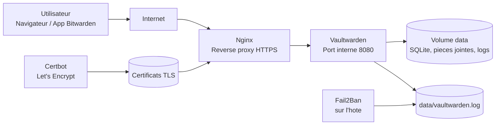

# Vaultwarden Docker

Deploiement Vaultwarden securise avec Docker Compose, Nginx et Let's Encrypt.


## Outils utilises

### Systemes & plateformes


### Services


## Architecture



Flux reseau:

- `80/tcp`: challenge Let's Encrypt puis redirection vers HTTPS.
- `443/tcp`: entree publique Nginx.
- `8080/tcp`: port interne Docker, non expose sur Internet.

## Apercu


Cette image est un apercu documentaire. Apres le premier demarrage, remplace-la par une vraie capture de ton instance si tu veux montrer l'ecran exact de ton serveur.

## Securite activee

- HTTPS via Nginx + Certbot.
- Vaultwarden n'expose aucun port public.
- Inscriptions, invitations et indices de mot de passe desactives par defaut.
- Token admin lu depuis un secret local non versionne.
- Conteneur Vaultwarden en utilisateur non-root.
- Capabilities Docker supprimees et `no-new-privileges` active.
- Filesystem des conteneurs en lecture seule quand possible.
- Logs Vaultwarden dans `data/vaultwarden.log`, compatibles Fail2Ban.
- Images epinglees: `vaultwarden/server:1.35.7-alpine`, `nginx:1.29-alpine`, `certbot/certbot:v5.0.0`.

## Prerequis

- Docker et Docker Compose.
- Un nom de domaine pointant vers le serveur.
- Ports `80/tcp` et `443/tcp` ouverts vers ce serveur.

## Installation

```bash
cp .env.example .env
./scripts/prepare.sh
```

Edite `.env` et remplace au minimum:

```dotenv
DOMAIN=https://vaultwarden.example.com
NGINX_HOST=vaultwarden.example.com
ACME_EMAIL=admin@example.com
```

Genere le token admin Argon2:

```bash
./scripts/generate-admin-token.sh
```

Initialise le certificat Let's Encrypt:

```bash
./scripts/init-letsencrypt.sh
```

Demarre ou redemarre la pile complete:

```bash
docker compose up -d
docker compose logs -f
```

L'interface admin sera disponible sur `https://ton-domaine/admin`.

## Renouvellement TLS

Ajoute une tache cron sur l'hote:

```cron
0 3 * * * cd /root/Vaultwarden && ./scripts/renew-certs.sh >/var/log/vaultwarden-certbot.log 2>&1
```

## Sauvegarde

```bash
./scripts/backup.sh
```

Les archives sont creees dans `backups/`, ignore par Git. Conserve aussi une copie hors du serveur.

## Mise a jour

Lis les notes de version Vaultwarden, puis:

```bash
docker compose pull
docker compose up -d
```

Dependabot est configure pour proposer les mises a jour des images Docker.

## Fail2Ban

Des exemples sont fournis dans `fail2ban/`. Sur un serveur Debian/Ubuntu:

```bash
sudo apt-get install fail2ban -y
sudo cp fail2ban/filter.d/*.local /etc/fail2ban/filter.d/
sudo cp fail2ban/jail.d/*.local /etc/fail2ban/jail.d/
sudo systemctl restart fail2ban
```

Si le projet n'est pas dans `/root/Vaultwarden`, adapte `logpath` dans les fichiers `fail2ban/jail.d/*.local` avant de les copier.

## Secrets

Ne publie jamais:

- `.env`
- `secrets/admin_token`
- `data/`
- `backups/`
- `certbot/certs/`

Ils sont deja ignores par `.gitignore`.
